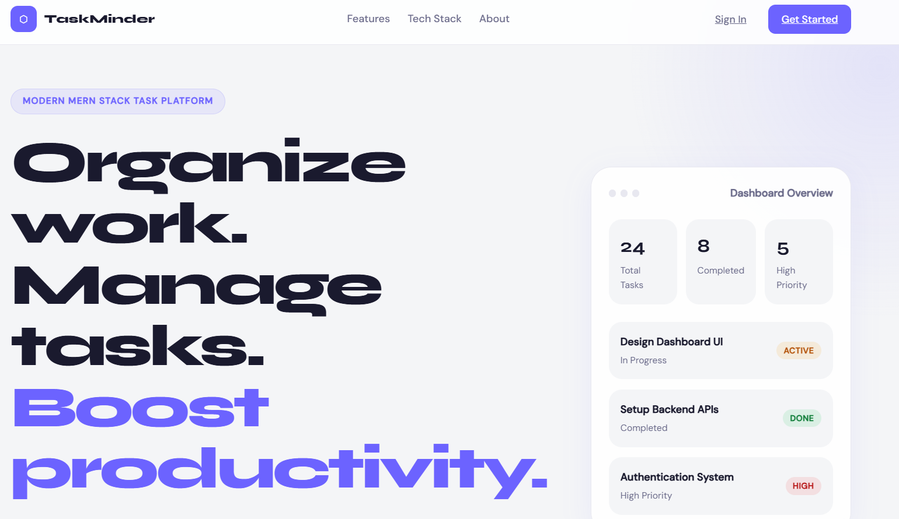
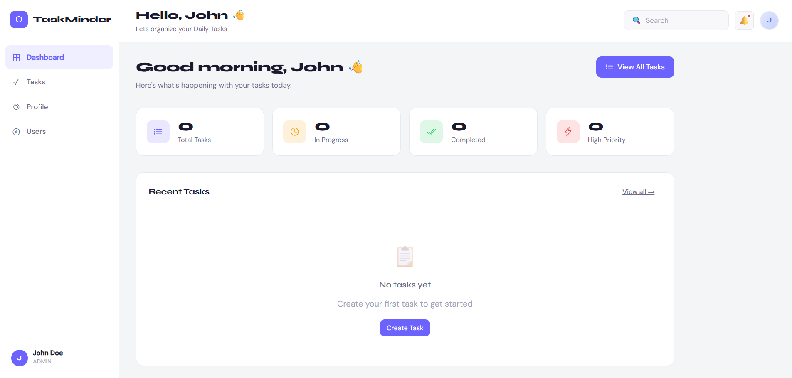
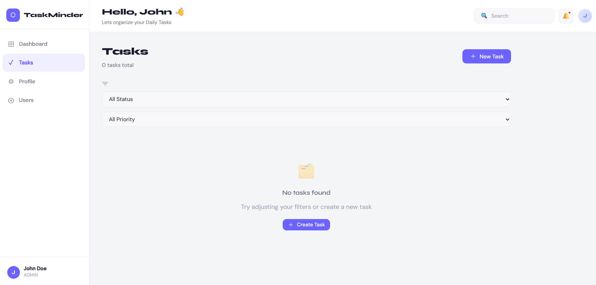
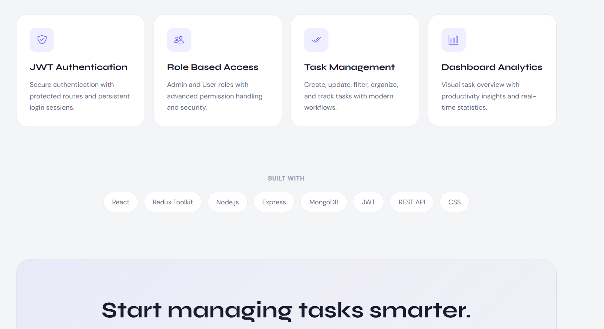

# TaskMinder – Task Manager API

A production-ready REST API with JWT authentication, role-based access control, and a React frontend.

---

## Tech Stack

| Layer | Technology |
|---|---|
| Backend | Node.js, Express.js (ESM) |
| Database | MongoDB + Mongoose |
| Auth | JWT (httpOnly cookie + Bearer header) |
| Validation | express-validator |
| Docs | Swagger UI (`/api/v1/docs`) |
| Logging | Winston |
| Security | Helmet, express-rate-limit, bcryptjs |
| Frontend | React 18, Redux Toolkit, React Router v6 |
| HTTP Client | Axios (interceptors for token injection) |

---

---

## Application Screenshots

<div align="center">




<br/><br/>




</div>

---

## Project Structure

```
├── backend/
│   └── src/
│       ├── config/          # DB, Swagger config
│       ├── controllers/     # user.controller, task.controller
│       ├── middlewares/     # auth, error, validate
│       ├── models/          # User, Task (Mongoose schemas)
│       ├── routes/          # user.routes, task.routes
│       ├── utils/           # AppError, JWT helpers, Logger
│       ├── validations/     # express-validator rules
│       ├── app.js           # Express app setup
│       └── server.js        # Entry point
│
└── frontend/
    └── src/
        ├── components/      # Auth/RequireAuth, Layout/Navbar, UI/TaskCard, TaskModal
        ├── pages/           # Home, Signin, Signup, Dashboard, Tasks, Admin, Profile
        ├── services/        # axios.js, auth.service.js, task.service.js
        └── store/slices/    # authSlice, taskSlice
```

---

## Setup & Run

### Prerequisites
- Node.js >= 18
- MongoDB running locally or a MongoDB Atlas URI

### Backend

```bash
cd backend
cp .env.example .env        # fill in your MONGO_URI and JWT_SECRET
npm install
npm run dev                 # starts on http://localhost:5000
```

### Frontend

```bash
cd frontend
npm install
npm run dev                 # starts on http://localhost:5173
```

Swagger docs available at: `http://localhost:5000/api/v1/docs`

---

## API Reference

### Auth (`/api/v1/user`)

| Method | Endpoint | Auth | Description |
|--------|----------|------|-------------|
| POST | `/register` | ❌ | Register new user |
| POST | `/login` | ❌ | Login, returns JWT |
| POST | `/logout` | ✅ | Clears cookie |
| GET | `/profile` | ✅ USER/ADMIN | Get own profile |
| PUT | `/profile` | ✅ USER/ADMIN | Update own profile |
| GET | `/all` | ✅ ADMIN | Get all users (paginated) |
| PATCH | `/:id/role` | ✅ ADMIN | Change user role |
| DELETE | `/:id` | ✅ ADMIN | Delete a user |

### Tasks (`/api/v1/tasks`)

| Method | Endpoint | Auth | Description |
|--------|----------|------|-------------|
| GET | `/` | ✅ | List tasks (own for USER, all for ADMIN) |
| POST | `/` | ✅ | Create task |
| GET | `/:id` | ✅ | Get task by ID |
| PUT | `/:id` | ✅ | Update task (owner or admin) |
| DELETE | `/:id` | ✅ | Delete task (owner or admin) |
| GET | `/stats` | ✅ ADMIN | Aggregated task stats |

**Query params for GET /tasks:** `status`, `priority`, `page`, `limit`, `sort`

---

## Database Schema

### User
```
fullName  String   required, 2–50 chars
email     String   unique, required
password  String   bcrypt hashed, select: false
role      Enum     USER | ADMIN  (default: USER)
avatar    String   optional
```

### Task
```
title       String   required, 3–100 chars
description String   optional, max 500 chars
status      Enum     TODO | IN_PROGRESS | DONE  (default: TODO)
priority    Enum     LOW | MEDIUM | HIGH         (default: MEDIUM)
dueDate     Date     optional
createdBy   ObjectId ref: User (required)
assignedTo  ObjectId ref: User (optional)
```
Indexes: `(createdBy, status)`, `(createdBy, priority)`

---

## Security Practices

- **Password hashing**: bcryptjs with salt rounds of 12
- **JWT**: signed with secret, stored in httpOnly cookie + Authorization header
- **Rate limiting**: 100 req/15min globally, 10 req/15min on auth routes
- **Helmet**: sets security HTTP headers
- **Input sanitization**: express-validator with `trim()` and `normalizeEmail()`
- **Role protection**: middleware checks role on every protected route
- **Error isolation**: custom AppError class prevents stack trace leaks in production

---

## Scalability Note

This project is structured to scale horizontally and vertically:

### Immediate wins
- **Mongoose indexes** on `(createdBy, status)` for fast filtered queries
- **Pagination** on all list endpoints to avoid full collection scans
- **Modular route/controller/service split** — adding new entities (e.g. projects, comments) follows the same pattern without touching existing code

### Scaling path
1. **Caching**: Add Redis in front of `GET /tasks` and `GET /user/all` with cache invalidation on mutations — reduces DB load by ~80% for read-heavy workloads
2. **Horizontal scaling**: Stateless JWT means any number of Node instances can handle requests behind a load balancer (NGINX / AWS ALB)
3. **Microservices**: Auth, Tasks, and Notifications can be split into separate services communicating via a message queue (RabbitMQ / Kafka) — the current controller/service boundary is already designed for this transition
4. **Database sharding**: MongoDB supports horizontal sharding on `createdBy` as the shard key for multi-tenant scale
5. **Docker / Kubernetes**: Add `Dockerfile` per service and a `docker-compose.yml` for local orchestration; move to K8s for production with auto-scaling pods
6. **Logging & observability**: Winston logs are structured JSON — pipe into ELK stack or Datadog for centralized monitoring and alerting

---

## License
MIT
